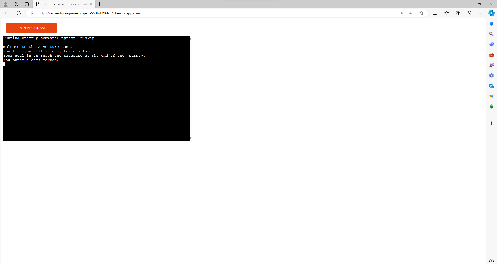

# Testing

Return back to the [README.md](README.md) file.

I systematically tested my files, examining various scenarios and validating functions. The process included handling edge cases and assessing performance. Through unit tests and user scenarios.

## Code Validation

### Python

I have used the recommended [PEP8 CI Python Linter](https://pep8ci.herokuapp.com) to validate all of my Python files.

| File | CI URL | Screenshot | Notes |
| --- | --- | --- | --- |
| run.py | [PEP8 CI](https://pep8ci.herokuapp.com/https://raw.githubusercontent.com/jesperba01/adventure-game/main/run.py) |  | Pass: No Errors |

## Browser Compatibility

I've tested my deployed project on multiple browsers to check for compatibility issues.

| Browser | run.py |
| --- | --- | --- | --- | --- | --- |
| Chrome |  | Works as expected |
| Edge |  | Works as expected |

## Lighthouse Audit

I've tested my deployed project using the Lighthouse Audit tool to check for any major issues.

| Page | Mobile | Desktop | Notes |
| --- | --- | --- | --- |
| Home |  |  | No Errors |

## Bugs

There are no bugs that I am aware of.
